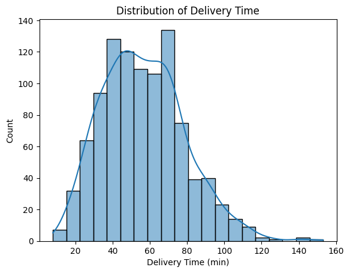
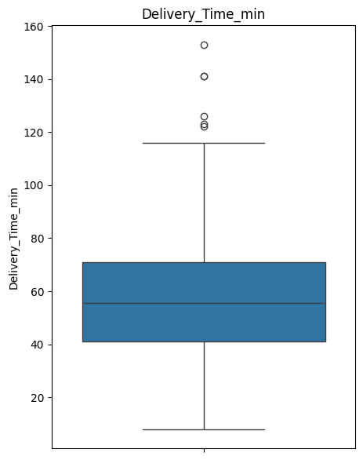
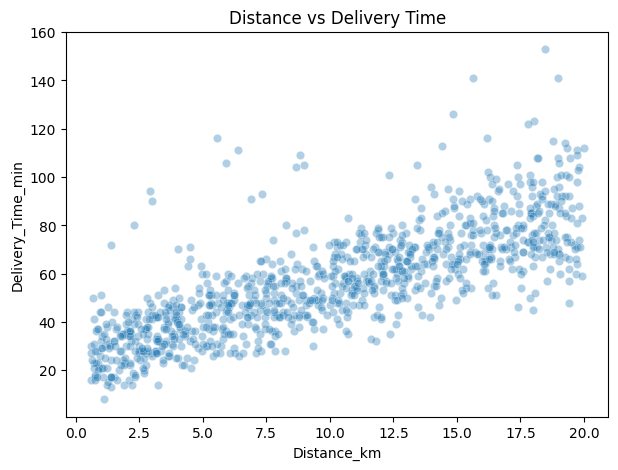
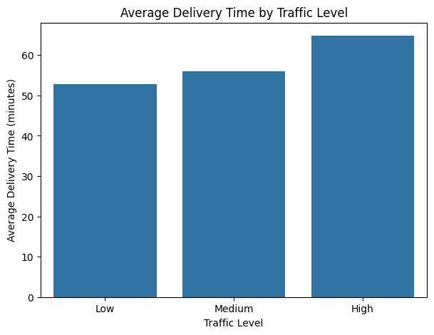
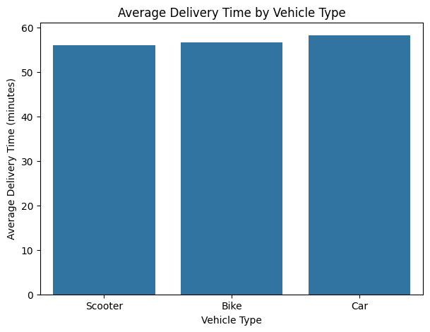
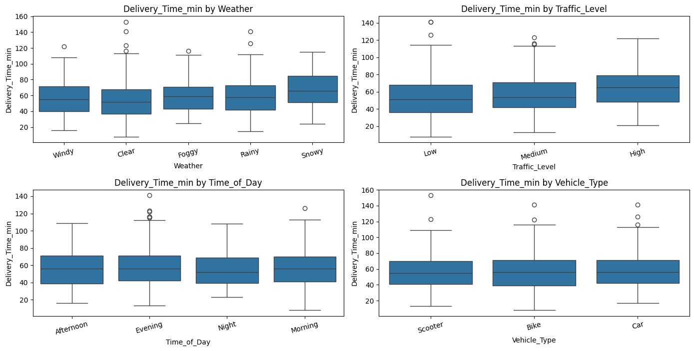
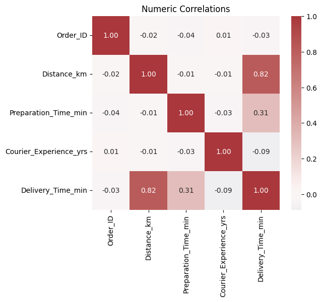

# EDA REPORT

## Objective

Explore the dataset to understand factors that influence **delivery_time_min**, check data quality, and identify relationships (distance, traffic, weather, preparation time, vehicle, courier experience, time of day) that guide feature engineering and reliable model deployment.

## Data Overview

This dataset is designed for predicting food delivery times based on various influencing factors such as distance, weather, traffic conditions, and time of day. Dataset includes **1000 rows** and **9 columns** (1000, 9).

| Column                 | Type        | Data Type   | Description                                           |
| ---------------------- | ----------- | ----------- | ----------------------------------------------------- |
| Order_ID               | Identifier  | int64       | Unique identifier for each order                      |
| Distance_km            | Numeric     | float64     | The delivery distance in kilometers                   |
| Weather                | Categorical | object      | Weather conditions: Clear, Rainy, Snowy, Foggy, Windy |
| Traffic_Level          | Categorical | object      | Traffic conditions: Low, Medium, High                 |
| Time_of_Day            | Categorical | object      | Time of delivery: Morning, Afternoon, Evening, Night  |
| Vehicle_Type           | Categorical | object      | Vehicle used for delivery: Bike, Scooter, Car         |
| Preparation_Time_min   | Numeric     | int64       | Time required to prepare the order (minutes)          |
| Courier_Experience_yrs | Numeric     | float64     | Courier’s experience in years                         |
| **Delivery_Time_min**  | Target      | int64       | Total delivery time in minutes                        |

> **Source**: [Kaggle: Food Delivery Time Prediction](https://www.kaggle.com/datasets/denkuznetz/food-delivery-time-prediction/).

> Analysis was obtained from the `01-eda.ipynb` notebook.

## Data Quality Checks

### Missing values

- `Weather`, `Traffic_Level`, `Time_of_Day`, `Courier_Experience_yrs` each have 30 missing entries (3% of rows).
- After examining the dataset the pattern found was consistent with MCAR (missing completely at random).  

### Duplicates

 - No duplicate rows detected.  

### Outliers

- Long deliveries (>120 min) exist but are plausible real-world delays, not errors.
- Target distribution unimodal, slightly right-skewed. Most fall 40–70 min, tail to 150 (See Fig. 1 and 2 below in Visualizations and Insights).

> Overall, data is mostly clean with minor missingness and limited outliers.

## Visualizations and Key Patterns

### Key Patterns

| Factor                 | Pattern/Statistical Effect                                                                                           |
| ---------------------- | -------------------------------------------------------------------------------------------------------------------- |
| Distance_km            | Strong positive correlation (r ≈ 0.82). Longer trips increase variance (see Fig. 3 and 7).                           |
| Preparation_Time_min   | Moderate correlation (r ≈ 0.31). Adds near-linear offset (see Fig. 7).                                               |
| Traffic_Level          | Clear monotonic effect (Low < Medium < High) (see Fig. 4).                                                           |
| Weather                | Rainy/Snowy inflate times; Clear/Windy lower (see Fig. 6).                                                           |
| Time_of_Day            | Evenings are slightly slower (see Fig. 6).                                                                           |
| Vehicle_Type           | Weak overall; scooters marginally faster in high traffic (see Fig. 5).                                               |
| Courier_Experience_yrs | Weak negative correlation (r ≈ –0.09). Possible interaction with complex conditions (see Fig. 7).                    |

### Visualizations

#### Fig. 1: Histogram of Delivery Time  

  

#### Fig. 2: Box Plot of Delivery Time  

  

#### Fig. 3: Scatterplot of Delivery Time vs Distance  

  

#### Fig. 4: Average Delivery Time by Traffic Level  

  

#### Fig. 5: Average Delivery Time by Vehicle Type  

  

#### Fig. 6: Box Plot of Categorical Columns vs Delivery Time  

  

#### Fig. 7: Pearson Correlation Matrix  

  

## Assumptions and Limitations

- Missing values (~3% in some columns) are assumed MCAR and handled by simple imputation.  
- Dataset covers 1000 samples; small size may limit generalization to larger populations.  
- No timestamp field found. Data assumed to be a random sample of operations; temporal trends can’t be studied.
- Extreme delays (>120 min) retained to reflect operational risk.

## Recommendations and Next Steps

After studying the data, the following choices were made to move forward with the development of the model:

- **Imputation**:  
  - **Numeric**: Median imputation because it is robust to skew and outliers.  
  - **Categorical**: Most frequent value imputation applied, since missingness is low (~3%) and this prevents loss of rows.  

- **Dropped Columns**:
  - `Order_ID` removed since it is only an identifier and carries no predictive signal.  

- **Encoding**:  
  - **One-Hot Encoding** for `weather`, `time_of_day`, and `vehicle_type` because they are nominal categories with no inherent order.  
  - **Ordinal Encoding** for `traffic_level` to reflect the natural order (Low < Medium < High). 

- **Outliers**:  
  - Kept in the dataset since rare long deliveries represent real-world delays. Excluding them would underestimate risk.  

- **Problem type**:  
  - This is a **supervised regression** problem, since the target `delivery_time_min` is continuous.  

- **Model choice**:  
  - **XGBoost** selected for its strong performance on tabular data, ability to capture nonlinear interactions, and it prevents overfitting.  

- **Evaluation Strategy**:
  - **Primary metric:** MAE (easily interpretable in minutes and focuses on typical operations).
  - **Secondary metrics:** RMSE (penalizes large errors), R² (variance explained).