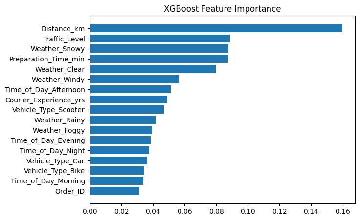

# Explainability

## What We Explain

We want to understand which input features most strongly influence delivery time predictions, based on the trained XGBoost model.

## Method

- Used XGBoost’s built-in **feature importance (gain)**, which measures how much each feature contributes to improving accuracy when used in splits.
- Visualized results with a bar chart of importance scores.

## Findings

| Feature               | Value (importance)  |
|-----------------------|---------------------|
| Distance_km           | 0.159893            |
| Traffic_Level         | 0.088763            |
| Weather_Snowy         | 0.087840            |
| Preparation_Time_min  | 0.087417            |
| Weather_Clear         | 0.079742            |
| Weather_Windy         | 0.065358            |
| Time_of_Day_Afternoon | 0.051314            |
| Courier_Experience_yrs| 0.049055            |
| Vehicle_Type_Scooter  | 0.046716            |
| Weather_Rainy         | 0.041556            |
| Weather_Foggy         | 0.039547            |
| Time_of_Day_Evening   | 0.038397            |
| Time_of_Day_Night     | 0.037473            |
| Vehicle_Type_Car      | 0.036483            |
| Vehicle_Type_Bike     | 0.034182            |
| Time_of_Day_Morning   | 0.033974            |
| Order_ID              | 0.031288            |

  

### Key Insights

- **Distance_km** is by far the most influential feature (importance = 0.159893).  
- **Traffic_Level** (0.088763) and **Preparation_Time_min** (0.087417) are also strong contributors.  
- **Weather_Snowy** (0.087840) shows that adverse weather can rival traffic in its effect on delivery time.
- **Preparation_Time_min**: (0.087417) Adds a consistent baseline offset to delivery time.
- **Order_ID** has negligible value, confirming it is just an identifier.  
- Other features (vehicle type, courier experience, time of day) have smaller but still meaningful contributions.  
- Weather effects outweigh time-of-day effects, meaning conditions matter more than scheduling.  
- Scooters slightly outperform cars and bikes, showing a marginal advantage.  

> Analysis was obtained from the best performing model at the end of the `03_model_experiments.ipynb` notebook.